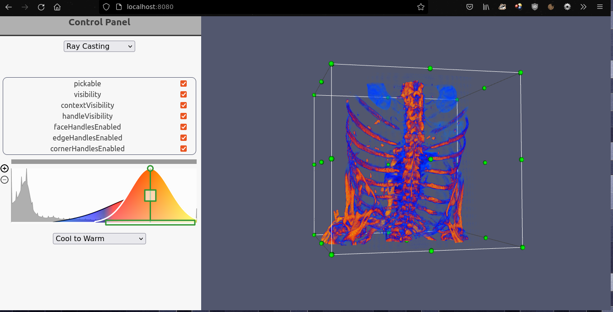
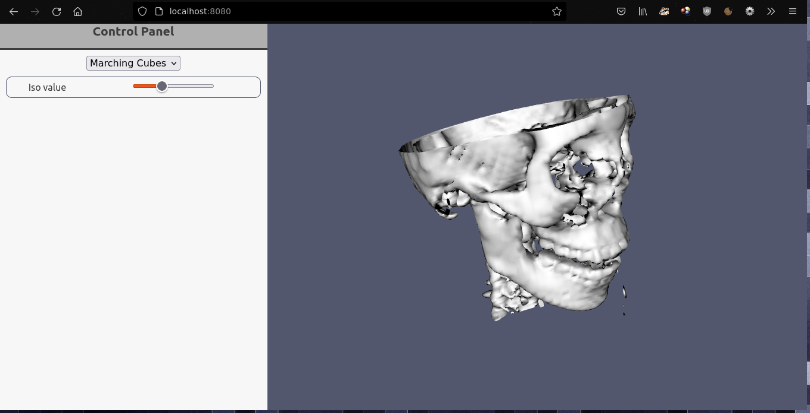
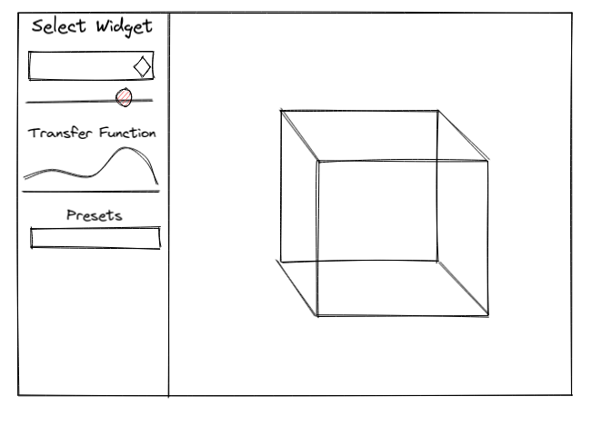

# SBE306 Assignment 4 (VTK) 

- [Description](#description)
- [Team](#team)
- [Samples](#samples)
- [Implementation Details](#implementation-details)
    - [Thought Process](#thought-process)
    - [Solution](#solution)
- [Issues](#issues)

## Description
A 3D medical viewer built with vtk-js

## Team
### Team Name : cg-gang
### Team Members
| Name         | Section     | BN |
|--------------|-----------|------------|
| Saied Salem Saied     | 1 | **36**       |
| Mohamed Ahmed Mohamed Ibrahim | 2      | **11**        |
| Moaaz Nasser Ibrahim     | 2 | **33**       |
| Yasin Essam Mohamed      | 2 | **49**       |

## Samples



## Implementation Details
### Thought Process
First we started by the design we need to accomplish. And this is the `final result` as belo. As in the design 
phase as we made more than one design and we choosed only one at the end.



Then our thought process was like that.
- Only make head marching cubes example work.
- Only make ray casting example work.
- Adding ray casting and volume rendring to `ImageCroppingWidget`
- Making a stateful control panel to control each wiget.
- Adding the adjustable transfer function.
- Adding some prests for color maps.

### Solution
After that we started the implementation with the help of the provided example in the docs.
We have tried a lot of things in react but we faced a lot of problems so we swithced back to 
vanilla js.

The core function in the appliction is the switching between rendering actors which we control via an option box and the event attached to it is as follow.
```javaScript
document.getElementById('examples-menu').addEventListener('change', function () {
    const croppingControl = document.querySelector('#cropping-control');
    const isoControl = document.querySelector('#iso-control');
    const rayTransferenceControl = document.querySelector('#ray-transfer-function');
    const presetsControl = document.querySelector('#presets-menu');

    if (this.value == "RAY_CASTING"){
        isoControl.style.visibility = 'hidden';
        croppingControl.style.visibility = 'visible';
        rayTransferenceControl.style.visibility = 'visible';
        presetsControl.style.visibility = 'visible';
        renderChest();
    }
    if (this.value == "MARCHING_CUBES"){
        isoControl.style.visibility = 'visible';
        croppingControl.style.visibility = 'hidden';
        presetsControl.style.visibility = 'hidden';
        rayTransferenceControl.style.visibility = 'hidden';
        renderHead();
    }
});

```

The `renderHead` function is used to load and render the marching cubes with the `head` data set

```javaScript

async function renderChest() {
    try {
        renderer.removeAllViewProps();
        genericRenderWindow.resize();
        renderWindow.render();

        await chestReaderSource.setUrl('https://kitware.github.io/vtk-js/data/volume/LIDC2.vti');
        await chestReaderSource.loadData();
                    .
                    .
                 
        initCroppingEventListeners(croppingWidget);
        widgetManager.addWidget(croppingWidget);
        renderer.addVolume(chestActor);
                    
                    .
                    .

```

The `renderChest` function is used to load and render the ray casting with the `chest` data set 

```javaScript
async function renderChest() {
    try {
        renderer.removeAllViewProps();
        genericRenderWindow.resize();
        renderWindow.render();

        await chestReaderSource.setUrl('https://kitware.github.io/vtk-js/data/volume/LIDC2.vti');
        await chestReaderSource.loadData();
                    .
                    .
                    
        initSliderEventListener(dataRange, firstIsoValue);
        marchingCube.setContourValue(firstIsoValue)
        renderer.addActor(headActor)
        
                    .
                    .

```

## Issues

**1. Migration from vtk.js to @kitware/vtk.js**

At the first try after node setup we have tried the cone example which is the default example in the vanilla js guide for vtk, every thing worked perfectly but when we tried to run any other example every thing crashed. Then we noticed that the imports are different which caused these problems. We fixed them using the migration guide from here [migration-guide](https://kitware.github.io/vtk-js/docs/intro_vtk_as_es6_dependency.html#Migrating-from-vtk-js-to-kitware-vtk-js). It seems that all the examples in the docs have that issue except the cone one. 

**2. Loading examples data**

Most the examples in the docs uses a `__BASE_PATH__` which is probably  an environment variable. We did some search an find out some data links like this one [chest-data](https://kitware.github.io/vtk-js/data/volume/LIDC2.vti) which we can use instead. 


**3. The reader type (XML, HTTP)**

After figuring out the data links we faced another problem that some links return _json data_ and others returns the actual _data file_. After digging into github issues we found that we need `vtkXMLImageDataReader` instead of `vtkHttpDataSetReader` in case of data file [How to load local .vti file](https://github.com/Kitware/vtk-js/issues/1329).

**4. Merging the examples together with only one `rederingWindow` and `one renderer`**

When we added the marching cubes with the ray casting in on rederingWindow we find that the 2 actors added on top of each other so we searched how to clear the rederingWindow before adding another actor and we found th soultion [here](https://github.com/Kitware/vtk-js/issues/1745) with `removeAllViewProps`

**5. Controlling the container of the rendering window**

We were using the `vtkFullScreenRenderWindow` but to add the control panel and control the postion of the window we switched to `vtkGenericRenderWindow` instead

**6. Adding the control panel as sidebar**

The control panel to be shown as a sidebar we used a `flex box` with column-direction

[](https://classroom.github.com/online_ide?assignment_repo_id=6634792&assignment_repo_type=AssignmentRepo)
